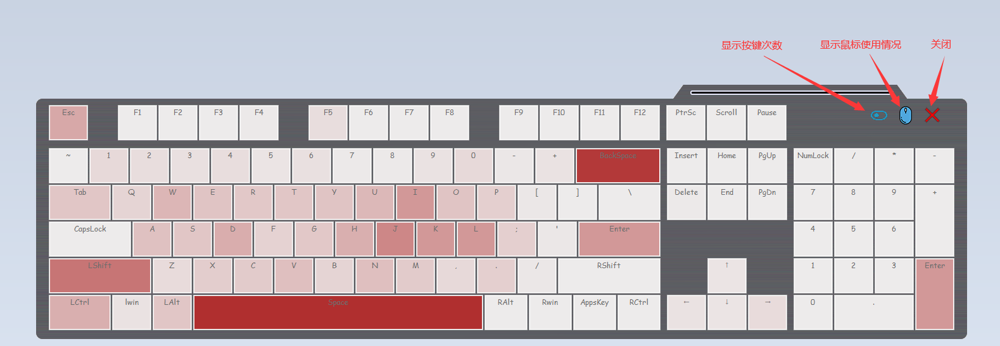

# 说明

统计键盘和鼠标使用情况

# 界面

# 自定义

## img
| 资源 | 作用 |
| ---- | ---- |
| img\tray.png | 托盘图标 |
| img\s1.png | 按键次数隐藏状态图标 |
| img\s2.png | 按键次数显示状态图标 |

## kmcount_data.ini

| 键名 | 作用 |
| ---- | ---- |
| c1,c2 | 统计界面键盘按钮颜色。根据使用频率从c1到c2渐变 |
| bgimg | 键盘背景图片，建议1470*400相素 |
| bgcolor | 键盘背景颜色，不存在背景图片时生效 |
| DESKTOP-XXXX | 设备信息 分别是 屏幕宽（毫米）,屏幕高（毫米）,屏幕尺寸（寸）。脚本首次启动会自动获取，但可能获取错误，可自行修改 |
